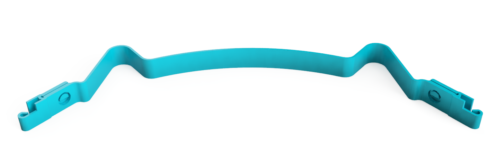
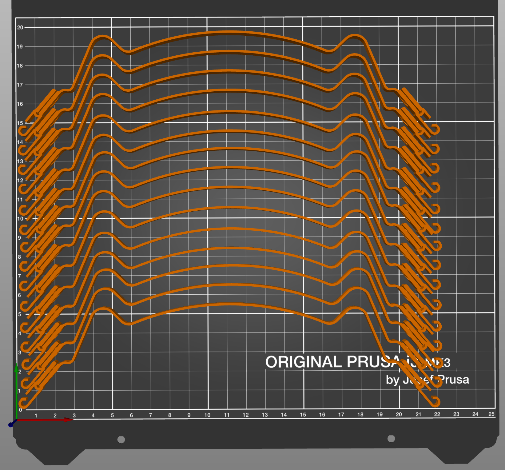

Mojet V2 - face shield
======================

Visière de protection, rapide à imprimer & monter

# Caractéristiques du support de visière 

- 🍕 **Simple à imprimer** ???? : 0 % de remplissage
- 🚀 Rapide à assembler : **seulement 2 trous de perforeuse standard** dans la feuille A4 transparente
- 🍟 Extrêmement compact : **15 pièces par impression** sur plateau 22 x 20 cm **sans empiler**
- 💎 **Très robuste** grâce à un système de pince et de crochet
- ⚡️ Rapide à démonter / monter pour nettoyage
- 👍 Une seule pièce (pas de clip)
- 💆 Face plastique avant (front) très souple pour améliorer le confort

# Évolution à venir : 

- Boucle pour élastique intégrée
- Kit pour remplacer les élastiques par des bandes de feuilles transparentes

# Matériel requis

- le support de visière mojet
- une feuille A4 transparente 100 à 400 um (testé avec 200um)
- une perforeuse dont l'écart du trou par rapport au bord de la feuille est de 11mm et le diamètre du trou est de 5,5mm
- une élastique
- deux boucles comme celles de New shield visière solidaire (possibilité de les intégrer)

# Instruction d'impression

- Plastique  PLA 
- Hauteur de couche : 0.3 mm
- 0% de remplissage
- 2 périmètres

# Historique des versions

- 2020-04-20 - V2 (actuelle)
- 2020-04-16 - V1 : perçage de la feuille compliqué, dépendant de la largeur de l'élastique

# Comparaison avec d'autres visières

Avec ces paramètres sur PrusaSlicer : Buse 0.4, 0% de remplissage, 2 périmètres, 50mm / s, PLA, 0.3 mm par couche

| Critère                            | Yann Vodable v25b | Yann Vodable v22 | Newshield-shark-v1-1 | Visor | Prusa shield RC3  | Mojet V2 |
|------------------------------------|-------------------|------------------|----------------------|-------|-------------------|----------|
| Quantité par plateau               | 8                 | 8                | 7                    | 2     | 4                 | 15       |
| Consommation plastique             | 5,49g             | 10,28g           | 10,95g               | 12g   | 46g               | 6,51g    |
| Temps d'impression                 | 24min             | 35min            | 42min                | 40min | 134min            | 24min    |
| Facilité du 1er assemblage         | C                 | C                | A                    | B     | C                 | B        |
| Rapidité démontage / montage       | B                 | B                | A                    | A     | A                 | A        |
| Simplicité usage / nettoyage       | B                 | B                | B                    | A     | B                 | B        |
| Solidité fixation                  | A                 | A                | B                    | B     | B                 | A        |
| Rigidité visière 200um             | ?                 | ?                | A                    | ?     | ?                 | B        |
| Simplicité d'impression 3D         | A                 | A                | C                    | A     | ?                 | ?        |

# Images

Exemples d'impression 

